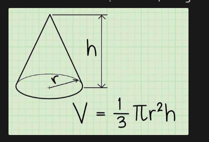
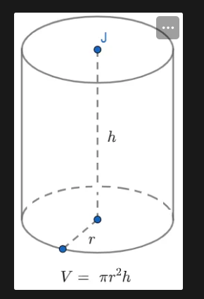
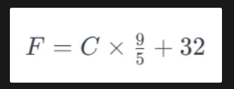
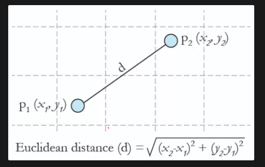
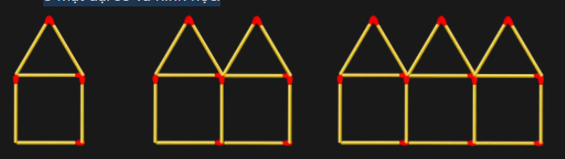

# JAVASCRIPT CƠ BẢN PHẦN 2

### Câu 01: Max number (Tìm số lớn nhất)

Đề bài: Viết hàm truyền vào 2 tham số. Sau đó tìm số lớn nhất trong 2 số đó.

**VÍ DỤ**
```javascript
findMaxNumber(10, 5) —> 10

findMaxNumber(10, 15) —> 15

findMaxNumber(100, 100) —> 100
```

### Câu 02: Bài toán FizzBuzz

Đề bài: Viết hàm kiểm tra đầu vào đã cho:
    - Nếu đầu vào chia hết cho 3 in ra: "Fizz"
    - Nếu đầu vào chia hết cho 5 in ra: "Buzz"
    - Nếu đầu vào chia hết cho 3 hoặc 5 in ra: "FizzBuzz"
    - Nếu đầu vào KHÔNG chia hết cho 3 hoặc 5 in ra: Giá trị đầu vào
    - Nếu đầu vào không phải là kiểu Number in ra: "Vui lòng nhập số!"

- Ví dụ:
    - "one" —> Vui lòng nhập số!
    - true —> Vui lòng nhập số!
    - 9 —> Fizz
    - 10 —> Buzz
    - 30 —> FizzBuzz
    - 11 —> 11

**VÍ DỤ**
```javascript
isfizzBuzz("one") —> Vui lòng nhập số!

isfizzBuzz(true) —> Vui lòng nhập số!

isfizzBuzz(9) —> Fizz

isfizzBuzz(10) —> Buzz

isfizzBuzz(30) —> FizzBuzz

isfizzBuzz(11) —> 11
```

### Câu 03: Tốc độ giới hạn

Đề bài: - Giả sử một người đi xe ô tô, có vận tốc là x (km/h). Viết hàm kiểm tra đầu vào x:
    - Nếu đầu vào x có vận tốc dưới 70km in ra: 'Vận tốc an toàn"

    - Nếu đầu vào x có vận tốc trên 70km, cứ vượt quá tốc độ mỗi 5km/h bị phạt 30000đ, in ra: "Bạn đã bị phạt: " + Số tiền bị phạt

    - Nếu đầu vào x có vận tốc trên 120km, bị tước giấy phép lái xe, in ra: "Bạn đã bị tước giấy phép lái xe"

**VÍ DỤ**
```javascript
checkSpeedLimit(40) —> Vận tốc an toàn

checkSpeedLimit(70) —> Vận tốc an toàn

checkSpeedLimit(75) —> Bạn đã bị phạt: 30000đ

checkSpeedLimit(99) —> Bạn đã bị phạt: 150000đ

checkSpeedLimit(120) —> Bạn đã bị tước giấy phép lái xe
```

### Câu 04: In ra key, value của object

Đề bài: Viết hàm kiểm tra và chỉ in ra các cặp key, value có value là kiểu string.

**VÍ DỤ**
```javascript
const person = {
    name: "Le Van A",
    age: 40,
    height: 175,
    country: "Viet Nam",
    designation: "UI Developer",
};
// In ra:
// name : Le Van A
// country : Viet Nam
// designation : UI Developer
// ----------

const technology = {
    name: "JavaScipt",
    version: 6,
    purpose: "Scripting language for Web",
    developer: "Netscape Corporation",
};
// In ra:
// name : JavaScipt
// purpose : Scripting language for Web
// developer : Netscape Corporation
// ----------
```

### Câu 05: Số nguyên tố

Đề bài: 
    - Viết chương trình nhập vào 1 số n. Dùng vòng lặp để lặp từ 2 đến n, kiểm tra xem các số đó có phải là số nguyên tố hay không? Nếu là số nguyên tố thì in ra: "Số nguyên tố: " + Số đó.

    - **Số nguyên tố** là tập hợp số tự nhiên **chỉ chia hết cho 1 và chính nó**. Có thể hiểu một cách đơn giản, với một số tự nhiên lớn hơn 1, nếu ngoài chữ số 1 và bản thân chính số đó thì nó không chia hết cho số nào khác nữa.

    - Ví dụ các số: 2, 3, 5, 7, 11, 13, 17, 23, 29,…đều được gọi là số nguyên tố.

    - Đặc biệt, có 2 trường hợp không được xét là nguyên tố đó chính là số 0 và số 1.

**VÍ DỤ**
```javascript
function isPrimeNumber(_number) {
  for (let factor = 2; factor < _number; factor++) {
    if (_number % factor === 0) {
      return false;
    }
  }
  return true;
}

function showPrimeNumbers(numberLimit) {
  for (let curNum = 2; curNum <= numberLimit; curNum++) {
    if (isPrimeNumber(curNum)) {
      console.log("Số nguyên tố:", curNum);
    }
  }
}

showPrimeNumbers(20); // Nhập vào 20

// In ra:
// Số nguyên tố: 2
// Số nguyên tố: 3
// Số nguyên tố: 5
// Số nguyên tố: 7
// Số nguyên tố: 11
// Số nguyên tố: 13
// Số nguyên tố: 17
// Số nguyên tố: 19
```

### Câu 06: 24-Hour Time

- Đề bài:
    -   Viết một hàm nhận thời gian ở định dạng AM/PM 12 giờ và trả về một chuỗi biểu diễn thời gian ở định dạng 24 giờ.
    
    - Ví dụ:
        - '07:05:45PM' —> '19:05:45'
        - '12:40:22AM' —> '00:40:22'
        - '12:45:54PM' —> '12:45:54'

**VÍ DỤ**
```javascript
convertTime("07:05:45PM") —> '19:05:45'

convertTime("12:40:22AM") —> '00:40:22'

convertTime("12:45:54PM") —> '12:45:54'
```


### Câu 07: Kiểm tra năm nhuận

Đề bài: 
    - Kiểm tra 1 năm có phải là năm nhuận hay không? Nếu là năm nhuận trả về true,  nếu không thì trả về false.

    - Năm nhuận là:
        - Chia hết cho 4 được và không chia hết cho 100 được.
        - Chia hết cho 100 sẽ được coi là năm nhuận nếu chúng cũng chia hết cho 400.

**VÍ DỤ**
```javascript
leapYear(2016) —> true

leapYear(2000) —> true

leapYear(1700) —> false

leapYear(1800) —> false

leapYear(100) —> false
```

### Câu 08: Lấy đuôi mở rộng của một file.

Đề bài: Viết một hàm để lấy được đuôi mở rộng của 1 file bất kỳ.

**VÍ DỤ**
```javascript
test.html —> html

abc.java —> java

xyz.js —> js
```

### Câu 09: If Conditions (Điều kiện If)

Đề bài: Phỏng đoán kết quả của console.log(). Sau đó code lại bài toán.  

**VÍ DỤ**
```javascript
let price = 100;
const discount = true;
const discountAmount = 30;
const country = "Việt Nam";

if (discount === true) {
    price -= discountAmount;
}
else if (country === "Thái Lan") {
    price -= 40;
} 
else if (country === "Hàn Quốc") {
    price -= 50;
} 
else {
    price -= 10;
}

console.log(price);
```

### Câu 10: Nested If Conditions (Lệnh if else lồng nhau)

Đề bài:  Phỏng đoán kết quả của console.log(). Sau đó code lại bài toán.

**VÍ DỤ**
```javascript
let price = 100;
const discount = false;
const discountAmount = 30;
const country = "Việt Nam";
const student = true;

if (discount === true) {
  price -= discountAmount;
} 
else if (country === "Việt Nam") {
    if (student === true) {
        price -= discountAmount + 30;
    }
    else {
        price -= discountAmount + 10;
    }
} 
else {  
    price -= 10;
}

console.log(price);
```

### Câu 11: Conditional Ternary Operator (Toán tử 3 ngôi)

Đề bài: Phỏng đoán kết quả của console.log(). Sau đó code lại bài toán.

**VÍ DỤ**
```javascript
const fullName = "Đặng Phương Nam";
const gender = "Nam";
const age = 17;

const vocative = gender === "Nam" ? "Ông" : "Bà";

console.log(vocative);

console.log(`Xin chào ${gender === "Nam" ? "Ông" : "Bà"} ${fullName}`);

console.log(`Xin chào ${vocative} ${fullName}`);

const drinkAlcohol =
    age < 18
        ? "Bạn chưa được phép uống rượu."
        : age >= 18 && age <= 60
        ? "Bạn nên uống ít rượu."
        : age > 60
        ? "Bạn không nên uống rượu."
        : "Bạn ơi! Bạn còn đó chứ!";

console.log(drinkAlcohol);
```

### Câu 12: Lấy ra tên.

Đề bài: Cho một mảng myFriends, hãy lấy ra danh sách tên bạn bè trong mảng myFriends.

**INPUT**
```javascript
const myFriends = [1, 2, "Nam", "Hùng", 3, 4, "Hòa", 6, "Long"];
```

**OUTPUT**
```javascript
["Nam", "Hùng", "Hòa", "Long"];
```

### Câu 13: Cửa hàng tiện lợi

- Đề bài:
    -   Cho một số tiền cần thanh toán và một mảng đại diện cho số tiền lẻ trong túi của bạn, xác định xem bạn có đủ tiền thanh toán cho đơn hàng không.

    - Viết một hàm changeEnough chuyền vào 2 đối số:
        - Đối số thứ nhất: Là 1 mảng các loại tiền có trong túi bạn theo thứ tự: quarter, dime, nickel, penny.

        - Đối số thứ hai: Tổng tiền mà khách hàng phải thanh toán.

**VÍ DỤ**
```javascript
changeEnough([2, 100, 0, 0], 14.11) ➞ false

changeEnough([0, 0, 20, 5], 0.75) ➞ true

changeEnough([30, 40, 20, 5], 12.55) ➞ true

changeEnough([10, 0, 0, 50], 3.85) ➞ false

changeEnough([1, 0, 5, 219], 19.99) ➞ false
```

**GHI CHÚ**
- quarter: 25 cents / $0.25
- dime: 10 cents / $0.10
- nickel: 5 cents / $0.05
- penny: 1 cent / $0.01

### Câu 14: Máy tính cơ bản

Đề bài: Tạo một hàm nhận vào hai số và một toán tử toán học + - / * và sẽ thực hiện một phép tính với hai số được cho.

**VÍ DỤ**
```javascript
calculator(2, "+", 2) ➞ 4
calculator(2, "*", 2) ➞ 4
calculator(4, "/", 2) ➞ 2
```

**LƯU Ý**   Nếu đầu vào chia cho 0, trả về: "Không thể chia cho 0!”

### Câu 15: Tính Thể Tích của Hình Nón

Đề bài: 
    -   Viết một hàm nhận chiều cao và bán kính của một hình nón làm đối số và trả về thể tích của hình nón, làm tròn đến hai chữ số sau dấu thập phân.

**LƯU Ý**
    - Sử dụng **Math.PI** của JavaScript, không sử dụng 3.14

    - Nếu hình nón không có thể tích, trả về 0.



**VÍ DỤ**
```javascript
coneVolume(3, 2) ➞ 12.57

coneVolume(15, 6) ➞ 565.49

coneVolume(18, 0) ➞ 0
```

### Câu 16: Tìm Giá Giảm Giá

Đề bài:
    - Viết một hàm nhận hai đối số: giá gốc và phần trăm giảm giá dưới dạng số nguyên và trả về giá cuối cùng sau khi giảm giá.

**VÍ DỤ**
```javascript
discount(1500, 50) ➞ 750

discount(89, 20) ➞ 71.2

discount(100, 75) ➞ 25
```

**LƯU Ý** Kết quả phải được làm tròn đến hai chữ số sau dấu thập phân.

### Câu 17: Trọng Lượng Của Hình Trụ

Đề bài:
    - Cho **bán kính r** và **chiều cao h** (tính bằng cm), tính khối lượng của một hình trụ khi nó được bơm đầy nước.

    - Kết quả in ra dạng kilogam (kg) và được làm tròn đến hai chữ số sau dấu thập phân.



**CÁCH GIẢI QUYẾT**
    - Tính thể tích của hình trụ

    - Chuyển đổi cm³ thành dm³
    
    - 1 dm³ = 1 lít, 1 lít tương đương với 1 kg

**VÍ DỤ**
```javascript
weight(4, 10) ➞ 0.5

weight(30, 60) ➞ 169.65

weight(15, 10) ➞ 7.07
```

### Câu 18: Trúng Độc Đắc

Đề bài:
    -   Viết một hàm nhận vào một mảng (kết quả của máy đánh bạc) và trả về true nếu tất cả các phần tử trong mảng đều giống nhau và false nếu ngược lại. Mảng sẽ chứa 4 phần tử.

**LƯU Ý:** Các giá trị phải giống hệt nhau thì mới có giải độc đắc.

**VÍ DỤ**
```javascript
testJackpot(["@", "@", "@", "@"]) ➞ true

testJackpot(["abc", "abc", "abc", "abc"]) ➞ true

testJackpot(["SS", "SS", "SS", "SS"]) ➞ true

testJackpot(["&&", "&", "&&&", "&&&&"]) ➞ false

testJackpot(["SS", "SS", "SS", "Ss"]) ➞ false
```

### Câu 19: Instant JAZZ

Đề bài: 
    -   Tạo một hàm để ghép số 7 vào cuối mỗi hợp âm trong một mảng. Bỏ qua tất cả các hợp âm đã kết thúc bằng 7.

**VÍ DỤ**
```javascript
jazzify(["G", "F", "C"])
➞ ["G7", "F7", "C7"]

jazzify(["Dm", "G", "E", "A"])
➞ ["Dm7", "G7", "E7", "A7"]

jazzify(["F7", "E7", "A7", "Ab7", "Gm7", "C7"])
➞ ["F7", "E7", "A7", "Ab7", "Gm7", "C7"]

jazzify([])
➞ []
```

**GHI CHÚ** Trả về một mảng rỗng nếu mảng cho trước là rỗng.

### Câu 20: Mảng Đối Xứng

Đề bài: Cho một mảng số nguyên, biến đổi mảng đó thành một mảng đối xứng.

**VÍ DỤ**
```javascript
mirror([0, 2, 4, 6]) ➞ [0, 2, 4, 6, 4, 2, 0]

mirror([1, 2, 3, 4, 5]) ➞ [1, 2, 3, 4, 5, 4, 3, 2, 1]

mirror([3, 5, 6, 7, 8]) ➞ [3, 5, 6, 7, 8, 7, 6, 5, 3]
```

**GHI CHÚ**Không lặp lại phần tử cuối cùng của mảng đã cho.

### Câu 21: Tìm Số Thiếu

Đề bài: Tạo một hàm nhận vào một mảng các số từ 1 đến 10 (trừ một số) và trả về số thiếu.

**VÍ DỤ**
```javascript
missingNum([1, 2, 3, 4, 6, 7, 8, 9, 10]) ➞ 5

missingNum([7, 2, 3, 6, 5, 9, 1, 4, 8]) ➞ 10

missingNum([10, 5, 1, 2, 4, 6, 8, 3, 9]) ➞ 7
```

**CHÚ Ý** 
    - Mảng các số sẽ không được sắp xếp (không theo thứ tự).

    - Chỉ có một số sẽ bị thiếu.

### Câu 22: Tính Sự Bằng Nhau của 3 Giá Trị

Đề bài: Tạo một hàm nhận vào ba đối số số nguyên (a, b, c) và trả về số lượng các số nguyên có cùng giá trị.

**VÍ DỤ**
```javascript
equal(3, 4, 3) ➞ 2

equal(1, 1, 1) ➞ 3

equal(3, 4, 1) ➞ 0
```

**Lưu ý:** Hàm của bạn phải trả về 0, 2 hoặc 3.

### Câu 23: Viết hoa tên của bạn

Đề bài: Tạo một hàm nhận vào một mảng các tên và trả về một mảng trong đó chỉ có chữ cái đầu tiên của mỗi tên được viết hoa.

**VÍ DỤ**
```javascript
capMe(["mavis", "senaida", "letty"])
➞ ["Mavis", "Senaida", "Letty"]

capMe(["samuel", "MABELLE", "letitia", "meridith"])
➞ ["Samuel", "Mabelle", "Letitia", "Meridith"]

capMe(["Slyvia", "Kristal", "Sharilyn", "Calista"])
➞ ["Slyvia", "Kristal", "Sharilyn", "Calista"]
```

### Câu 24: Ba Số Là Bộ Ba Pythago

- Đề bài:
    Tạo một hàm kiểm tra xem ba số nguyên đã cho có tạo thành một bộ ba Pythago không. Tổng của bình phương của hai số nhỏ nhất phải bằng bình phương của số lớn nhất để được xác nhận đúng.

**Ví dụ:**
```javascript
isTriplet(3, 4, 5) ➞ true
// 3² + 4² = 25
// 5² = 25

isTriplet(13, 5, 12) ➞ true
// 5² + 12² = 169
// 13² = 169

isTriplet(1, 2, 3) ➞ false
// 1² + 2² = 5
// 3² = 9
```

**GHI CHÚ** Các số có thể không được cho theo thứ tự tăng dần.

### Câu 25: Trả về ký tự ở giữa của chuỗi

- Đề bài:
    - Viết một hàm nhận vào một chuỗi và trả về ký tự ở giữa của chuỗi đó.
    - Nếu độ dài của chuỗi là lẻ, trả về ký tự ở giữa.
    - Nếu độ dài của chuỗi là chẵn, trả về hai ký tự ở giữa.

**Ví dụ:**
```javascript
getMiddle("test") ➞ "es"

getMiddle("testing") ➞ "t"

getMiddle("middle") ➞ "dd"

getMiddle("A") ➞ "A"
```

**GHI CHÚ** Tất cả các trường hợp kiểm tra đều chứa một từ duy nhất (dưới dạng một chuỗi).

### Câu 26: Chuyển đổi nhiệt độ

- Đề bài: 
    - Viết một chương trình nhận đầu vào là nhiệt độ ở đơn vị Celsius và chuyển đổi nó sang Fahrenheit và Kelvin.

    - Trả về các giá trị nhiệt độ chuyển đổi trong một mảng.

**CÔNG THỨC TÍNH NHIỆT ĐỘ Fahrenheit từ Celsius**


**CÔNG THỨC TÍNH NHIỆT ĐỘ Kevil từ Celsius**


**Ví dụ:**
```javascript
tempConversion(0) ➞ [32, 273.15]
// 0°C tương đương với 32°F và 273.15 K.

tempConversion(100) ➞ [212, 373.15]

tempConversion(-10) ➞ [14, 263.15]

tempConversion(300.4) ➞ [572.72, 573.55]
```

**LƯU Ý**:
    - Trả về các giá trị nhiệt độ tính đến hai chữ số thập phân.
    - Trả về "Invalid" nếu K nhỏ hơn 0.

### Câu 27: Độ dài đoạn thẳng

- Đề bài:
    -   Viết một hàm nhận vào tọa độ của hai điểm trên một mặt phẳng hai chiều và trả về độ dài của đoạn thẳng nối hai điểm đó.



**Ví dụ:**
```javascript
lineLength([15, 7], [22, 11]) ➞ 8.06

lineLength([0, 0], [0, 0]) ➞ 0

lineLength([0, 0], [1, 1]) ➞ 1.41
```

**LƯU Ý**
    - Thứ tự các số cho trước là X, Y.
    - Làm tròn kết quả đến hai chữ số sau dấu thập phân.

### Câu 28: Lọc và Sắp Xếp Duy Nhất

- Đề bài:
    -   Cho một mảng các số, viết một hàm trả về một mảng mới:
        -   Loại bỏ tất cả các phần tử trùng lặp.
        -   Sắp xếp từ nhỏ đến lớn.

**Ví dụ:**
```javascript
uniqueSort([1, 2, 4, 3]) ➞ [1, 2, 3, 4]

uniqueSort([1, 4, 4, 4, 4, 4, 3, 2, 1, 2]) ➞ [1, 2, 3, 4]

uniqueSort([6, 7, 3, 2, 1]) ➞ [1, 2, 3, 6, 7]
```

### Câu 29: Chuyển đổi một câu thành chuỗi viết tắt

- Đề bài:
    - Viết một chương trình JavaScript nhận đầu vào là một câu và chuyển đổi nó thành chuỗi viết tắt theo quy tắc sau:

        - Loại bỏ các khoảng trắng ở đầu và cuối câu (nếu có).

        - Chuyển đổi các từ thành chữ viết tắt bằng cách lấy ký tự đầu tiên của mỗi từ (trừ từ 'và') và thêm dấu chấm sau mỗi từ.
    
**Ví dụ:**
```javascript
" Học và lập trình là thú vị   "
➞ "H. và L. T. L. T. V."

" Công ty Công Nghệ và Dịch Vụ DACA "
➞ "C. T. C. N. và D. V. D."
```

**Ghi chú:**
```javascript
    - n sẽ luôn là một số nguyên dương.
    - Công thức tính số sao thứ n có thể được biểu diễn bởi công thức: **6n(n-1) + 1**.
```

### Câu 30: Loại bỏ các ký tự trùng lặp trong một chuỗi

- Đề bài:
    -   Viết một chương trình JavaScript nhận đầu vào là một chuỗi và loại bỏ các ký tự trùng lặp, chỉ giữ lại mỗi ký tự một lần.

    - Yêu cầu:
        - Loại bỏ các khoảng trắng ở đầu và cuối chuỗi.
        - Chuyển đổi chuỗi thành chữ thường.
        - Tạo một chuỗi mới chỉ chứa các ký tự không trùng lặp.

**Ví dụ:**
```javascript
"Hello world" ➞ "helo wrd"

"Mississippi" ➞ "misp"

"28Tech" ➞ "28tech"
```

### Câu 31: Đếm số từ trong một chuỗi
- Đề bài:
    -   Viết một chương trình JavaScript nhận đầu vào là một chuỗi và trả về số từ trong chuỗi đó.

- Ví dụ:
    - Đầu vào là "    JavaScript là một ngôn ngữ lập trình   " ⇒ Đầu ra là 7
    - Đầu vào là "Xin chào, mình là 28Tech!" ⇒ Đầu ra là 5

**VÍ DỤ**
```javascript
"    JavaScript là một ngôn ngữ lập trình   "
➞ 7

"Xin chào, mình là 28Tech!"
➞ 5
```

### Câu 32: Tìm từ dài nhất trong chuỗi
-   Đề bài: Viết một chương trình JavaScript nhận đầu vào là một chuỗi và trả về từ dài nhất trong chuỗi đó.

**VÍ DỤ**
```javascript
" JavaScript là ngôn ngữ lập trình phổ biến nhất "
➞ "JavaScript"

" Mình là Le Van A "
➞ "Mình"
```

### Câu 33: Tính tổng và trung bình của các số
- Đề bài:
    -   Viết một chương trình JavaScript để tính tổng và trung bình của một dãy số nhập vào từ người dùng.
    
        - Yêu cầu người dùng nhập vào một dãy số, mỗi số cách nhau bằng dấu phẩy.

        - Tính tổng của tất cả các số và hiển thị ra màn hình console.
        
        - Tính trung bình của các số (nếu có) và hiển thị ra màn hình console với độ chính xác hai chữ số sau dấu thập phân, sử dụng toFixed() để làm tròn.

    - Lưu ý:
        - Nếu một trong các giá trị nhập không phải là số, bỏ qua giá trị đó và tính tổng, trung bình của các số hợp lệ.
        
        - Nếu không có số hợp lệ nào, hiển thị thông báo "Không có số hợp lệ để tính".

**VÍ DỤ**
```javascript
- Đầu vào là **"5, 8, 10, abc, 12"** ⇒ Đầu ra là:
    - Tổng các số là: **35**
    - Trung bình các số là: **8.75**

- Đầu vào là **"10, 20, 30"** ⇒ Đầu ra là:
    - Tổng các số là: **60**
    - Trung bình các số là: **20.00**
```

### Câu 34: Quản lý danh sách công việc
- Đề bài:
    -   Hãy viết một chương trình JavaScript để quản lý danh sách công việc. Chương trình sẽ cho phép người dùng thêm công việc mới vào danh sách và hiển thị danh sách công việc.

    - Yêu cầu:
        1. Tạo một danh sách công việc ban đầu rỗng.

        2. Hiển thị menu cho phép người dùng chọn các tùy chọn sau:
            - Thêm công việc mới.
            - Hiển thị danh sách công việc.
            - Thoát chương trình.
        
        3. Nếu người dùng chọn "Thêm công việc mới", yêu cầu họ nhập tên công việc và thêm công việc đó vào danh sách sử dụng hàm push().
        
        4. Nếu người dùng chọn "Hiển thị danh sách công việc", hiển thị tất cả các công việc trong danh sách ra màn hình.
        
        5. Nếu người dùng chọn "Thoát chương trình", kết thúc chương

**ĐÁP ÁN**
```javascript
// Tạo một danh sách công việc ban đầu rỗng.
var danhSachCongViec = [];

while (true) {
  // Hiển thị menu cho phép người dùng chọn
    var luaChon = prompt(`
        Chọn tùy chọn:
        1. Thêm công việc mới
        2. Hiển thị danh sách công việc
        3. Thoát chương trình
    `);

    if (luaChon === "1") { // Thêm công việc mới vào danh sách
        var tenCongViec = prompt("Nhập tên công việc:");

        danhSachCongViec.push(tenCongViec);
        
        console.log("Công việc đã được thêm vào danh sách.");
    }
    else if (luaChon === "2") { // Hiển thị danh sách công việc
        if (danhSachCongViec.length === 0) {
            console.log("Danh sách công việc đang trống.");
        } 
        else {
            console.log("Danh sách công việc:");
            
            for (var i = 0; i < danhSachCongViec.length; i++) {
                console.log(i + 1 + ". " + danhSachCongViec[i]);
        }
    }
  }
  else if (luaChon === "3") { // Thoát chương trình
    console.log("Chương trình đã kết thúc.");
    break;
  }
  else { // Lựa chọn không hợp lệ
    console.log("Tùy chọn không hợp lệ.");
  }
}
```

### Câu 35: Giải Phương Trình
- Đề bài:   Viết một hàm nhận vào một phương trình (ví dụ: "1+1") và trả về kết quả.

**VÍ DỤ**
```javascript
equation("1+1") ➞ 2

equation("7*4-2") ➞ 26

equation("1+1+1+1+1") ➞ 5

equation("6+6*6-6") ➞ 36

equation("15+20*6-12") ➞ 123
```

**GHI CHÚ** Các toán tử được hỗ trợ là +, -, và *

### Câu 36: Matchstick Houses (Nhà diêm)
- Đề bài:   Thách thức này sẽ giúp bạn hiểu và giải thích mối quan hệ toán học cả ở mặt đại số và hình học.



-   Tạo một hàm nhận vào một số n (số ngôi nhà) và trả về số lượng que diêm cần thiết để xây lên n ngôi nhà đó. Xem ngôi nhà 1, 2 và 3 trong hình ảnh ở trên.

**VÍ DỤ**
```javascript
matchHouses(1) ➞ 6

matchHouses(4) ➞ 21

matchHouses(87) ➞ 436
```

**GHI CHÚ** 
    - Nếu n = 0 trả về 0 que diêm.
    - Đầu vào n sẽ luôn là một số nguyên không âm.

    
### Câu 37: Sum of Cubes (Tổng các khối lập phương)
- Đề bài:   Tạo một hàm nhận vào một mảng các số và trả về tổng của các lập phương của chúng.


-   Tạo một hàm nhận vào một số n (số ngôi nhà) và trả về số lượng que diêm cần thiết để xây lên n ngôi nhà đó. Xem ngôi nhà 1, 2 và 3 trong hình ảnh ở trên.

**VÍ DỤ**
```javascript
sumOfCubes([1, 5, 9]) ➞ 855
// Vì 1^3 + 5^3 + 9^3 = 1 + 125 + 729 = 855

sumOfCubes([3, 4, 5]) ➞ 216

sumOfCubes([2]) ➞ 8

sumOfCubes([]) ➞ 0
```

**GHI CHÚ** Nếu cho một mảng trống, trả về 0.

### Câu 38: Tổng các phần tử số trong một mảng
- Đề bài:   Các phần tử của mảng có thể có các kiểu dữ liệu khác nhau. Hãy tính tổng tất cả các phần tử có kiểu number trong mảng đã cho. Tạo một hàm nhận vào một mảng và trả về tổng của tất cả các số trong mảng.

**VÍ DỤ**
```javascript
numbersSum([1, 2, "13", "4", "645"]) ➞ 3

numbersSum([true, false, "123", "75"]) ➞ 0

numbersSum([1, 2, 3, 4, 5, true]) ➞ 15
```

**GHI CHÚ** Nếu cho một mảng trống, trả về 0.

### Câu 39: Số lớn nhất
- Đề bài:   Tạo một hàm nhận vào hai đối số là một số n vả một mảng các số array, và trả về một mảng n số lớn nhất từ mảng đầu vào.

**VÍ DỤ**
```javascript
largestNumbers(n, array)

largestNumbers(2, [4, 3, 2, 1]) ➞ [3, 4]

largestNumbers(1, [7, 19, 4, 2]) ➞ [19]

largestNumbers(3, [14, 12, 57, 11, 18, 16]) ➞ [16, 18, 57]

largestNumbers(0, [1, 3, 4, 2]) ➞ []
```

**GHI CHÚ** Mảng trả về phải được sắp xếp theo thứ tự tăng dần.

### Câu 40: Sam có ở cùng Frodo không?
- Đề bài:   Sam và Frodo cần phải ở gần nhau. Nếu họ đứng cạnh nhau trong mảng, hàm của bạn sẽ trả về true. Nếu có một tên nằm giữa họ, trả về false.

**VÍ DỤ**
```javascript
middleEarth(["Frodo", "Sam", "Gandalf"]) ➞ true

middleEarth(["Frodo", "Saruman", "Sam"]) ➞ false

middleEarth(["Orc", "Sam", "Frodo", "Legolas"]) ➞ true
```

**GHI CHÚ** Chỉ có một Sam và một Frodo trong mảng.


